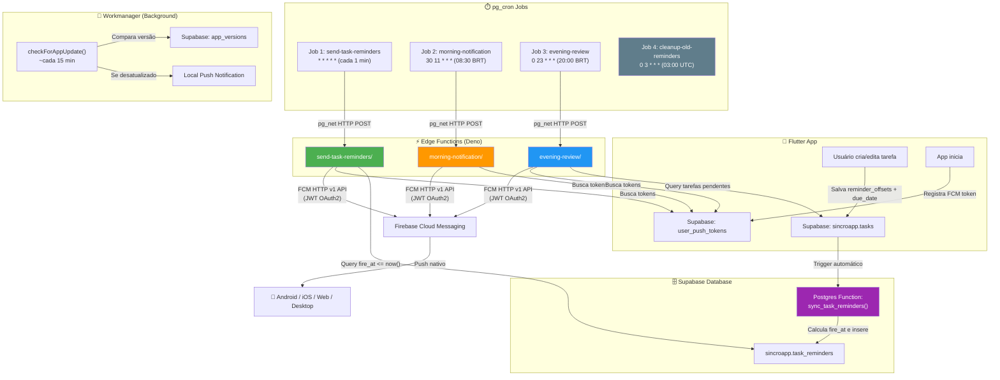
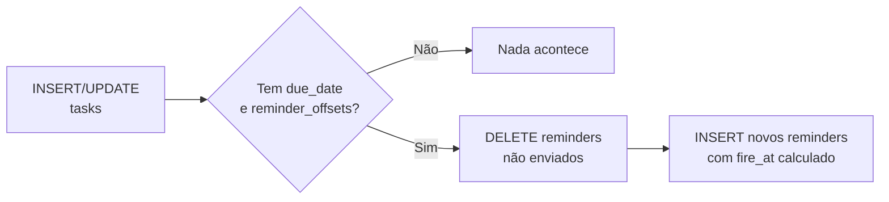
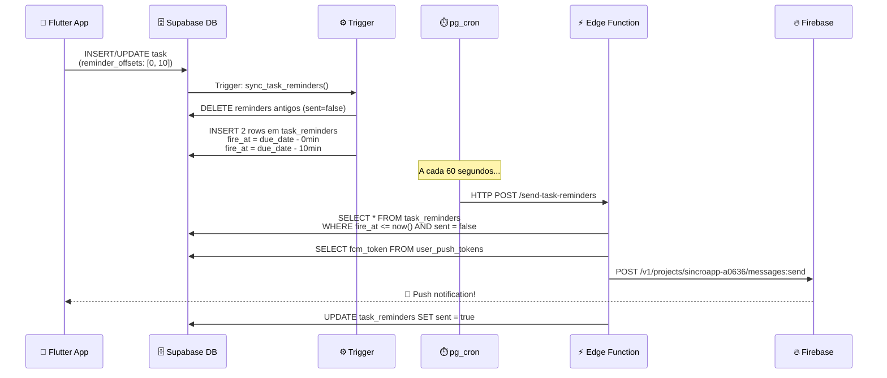
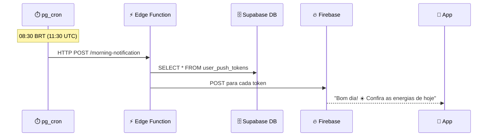
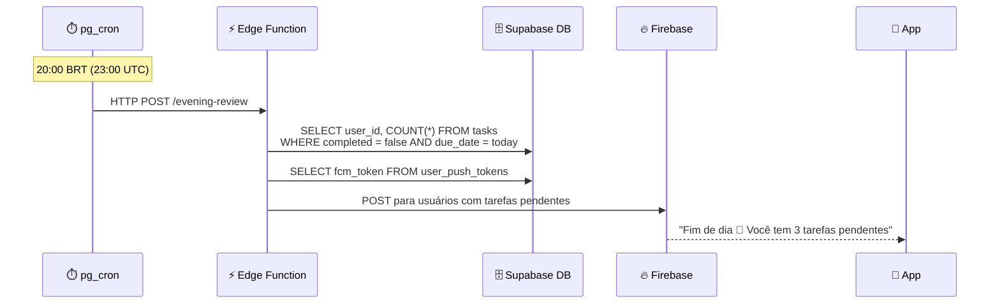
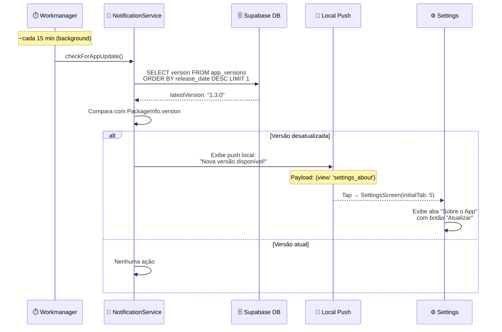
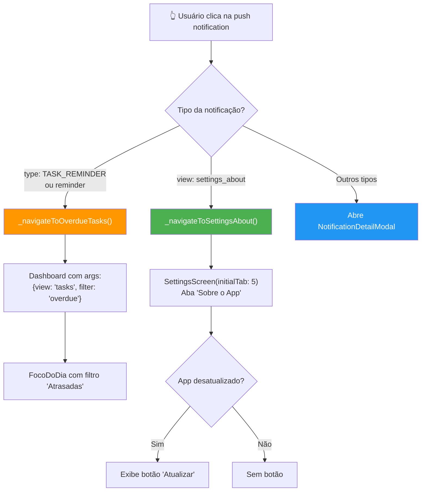
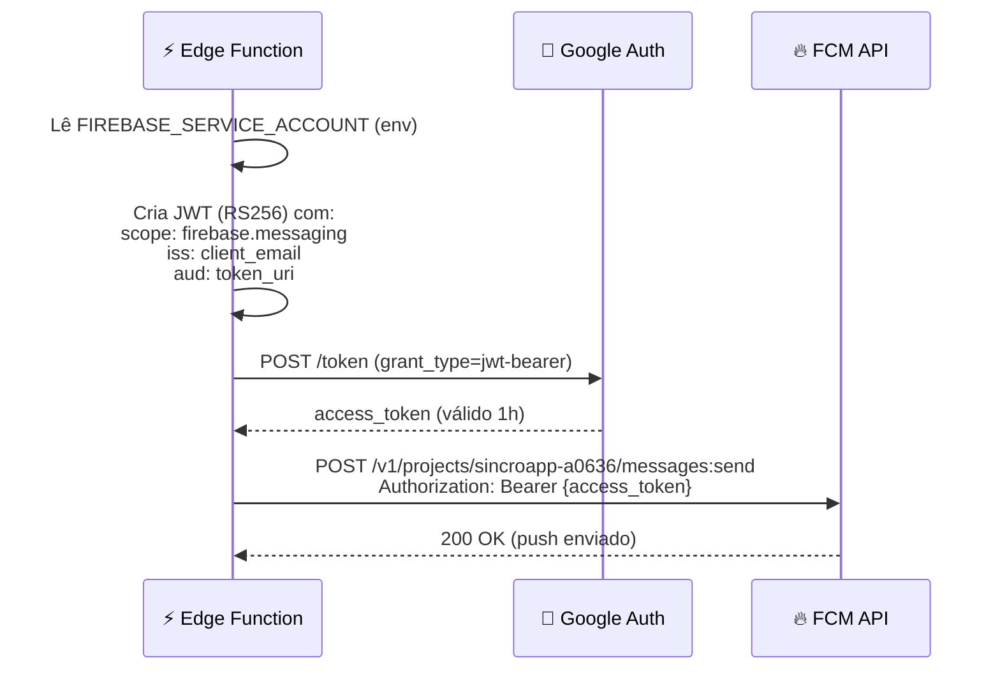

# 🔔 Sistema de Notificações Push — SincroApp

> Documentação completa do sistema de notificações push profissional e escalável.
> Última atualização: 2026-03-08 | Status: ✅ **Operacional**

---

## Visão Geral

O SincroApp utiliza um sistema **event-driven** para notificações push, rodando 100% dentro da infraestrutura do **Supabase self-hosted** (Edge Functions + pg_cron), sem dependência do servidor VPS para notificações.

### Stack de Tecnologias

| Componente | Tecnologia | Função |
|---|---|---|
| **Banco de Dados** | Supabase PostgreSQL (self-hosted) | Armazena tarefas, lembretes agendados, tokens FCM |
| **Agendamento** | `pg_cron` + `pg_net` | Executa jobs a cada minuto/hora/dia |
| **Lógica** | Supabase Edge Functions (Deno) | Processa lembretes e envia pushes |
| **Push Delivery** | Firebase Cloud Messaging (FCM) HTTP v1 | Entrega push para Android, iOS, Web, Desktop |
| **Client** | Flutter (`firebase_messaging`) | Recebe push e exibe notificações locais |

### Infraestrutura

| Recurso | Valor |
|---|---|
| **Supabase URL** | `https://supabase.studiomlk.com.br` |
| **Firebase Project ID** | `sincroapp-a0636` |
| **VPS IP** | `103.199.185.152` |
| **VPS SSH Port** | `2222` |
| **VPS Supabase Path** | `/var/www/app/supabase/` |
| **Edge Functions Path (servidor)** | `/var/www/app/supabase/volumes/functions/` |
| **Edge Functions Path (local)** | `supabase/functions/` |
| **Kong Port** | `7300` (interno) |
| **Studio Port** | `7200` (interno) |

---

## Arquitetura Geral



### Caminho completo de uma request

```
App/pg_cron → HTTPS → Nginx (:443) → Kong (:7300) → Edge Runtime (:9000) → Função
```

O Nginx é o reverse proxy público. Kong é o API Gateway do Supabase. O Edge Runtime executa as funções Deno.

---

## Tabelas do Banco de Dados

### `sincroapp.tasks` (Campos relevantes para notificações)

| Coluna | Tipo | Descrição |
|---|---|---|
| `id` | uuid | ID da tarefa |
| `user_id` | uuid | Dono da tarefa |
| `text` | text | Texto da tarefa |
| `due_date` | timestamptz | Data/hora do agendamento |
| `completed` | boolean | Se está concluída |
| `reminder_offsets` | jsonb | Array de minutos antes do due_date: `[0, 10, 30]` |
| `reminder_at` | timestamptz | Legado: horário fixo do lembrete |
| `journey_title` | text | Título da jornada (para contexto no push) |

> **Colunas removidas:** `reminder_hour`, `reminder_minute`, `shared_from_user_id`, `reminder_sent` (não eram mais usadas)

### `sincroapp.task_reminders` ⭐ Nova

| Coluna | Tipo | Descrição |
|---|---|---|
| `id` | uuid | ID do lembrete (PK, auto-gerado) |
| `task_id` | uuid | FK → tasks.id (CASCADE DELETE) |
| `user_id` | uuid | Dono (denormalizado para performance) |
| `offset_minutes` | integer | Offset em minutos (0 = na hora exata) |
| `fire_at` | timestamptz | **Horário exato de disparo** (pré-calculado) |
| `sent` | boolean | Se já foi enviado (default: false) |
| `sent_at` | timestamptz | Quando foi enviado |

> **Cada offset = 1 row.** Se uma tarefa tem `reminder_offsets: [0, 10, 30]`, a trigger cria 3 rows, cada uma com `fire_at = due_date - offset_minutes`.

**Indexes:**
- `idx_task_reminders_pending` → fire_at onde sent = false (busca rápida)
- `idx_task_reminders_task` → task_id (join com tasks)
- `idx_task_reminders_user` → user_id (busca por usuário)

### `sincroapp.user_push_tokens`

| Coluna | Tipo | Descrição |
|---|---|---|
| `user_id` | uuid | ID do usuário |
| `fcm_token` | text | Token FCM do dispositivo |

---

## Trigger: `sync_task_reminders()`

Trigger automático na tabela `tasks` (INSERT e UPDATE) que:

1. **Deleta** lembretes antigos não enviados da tarefa
2. **Calcula** `fire_at` para cada offset: `due_date - (offset * interval '1 minute')`
3. **Insere** novos rows em `task_reminders`
4. **Ignora** tarefas sem `due_date` ou sem `reminder_offsets`



---

## pg_cron Jobs (4 Agendamentos)

| Job | Schedule (UTC) | Horário BRT | Função |
|---|---|---|---|
| **1** | `* * * * *` | Cada 1 minuto | `send-task-reminders` — Busca lembretes vencidos e envia push |
| **2** | `30 11 * * *` | 08:30 | `morning-notification` — Push matinal motivacional |
| **3** | `0 23 * * *` | 20:00 | `evening-review` — Push noturno com tarefas pendentes |
| **4** | `0 3 * * *` | 00:00 | Limpeza de lembretes enviados há mais de 7 dias |

**Verificar jobs:**
```sql
-- Jobs agendados
SELECT * FROM cron.job;

-- Últimas execuções
SELECT * FROM cron.job_run_details ORDER BY start_time DESC LIMIT 10;
```

---

## Fluxos Detalhados

### Fluxo 1: Lembrete de Tarefa



### Fluxo 2: Notificação Matinal (08:30 BRT)



### Fluxo 3: Revisão Noturna (20:00 BRT)



### Fluxo 4: Verificação de Atualização do App



### Fluxo 5: Roteamento de Tap em Push Notifications



---

## Autenticação Firebase (JWT OAuth2)

As Edge Functions usam a **FCM HTTP v1 API** (API moderna) com autenticação JWT:



> A chave privada RSA do service account é usada para assinar o JWT. Não é necessário nenhum SDK do Firebase — tudo é feito via HTTP puro.

---

## Arquivos do Sistema

### Edge Functions (Servidor: `/var/www/app/supabase/volumes/functions/`)

| Arquivo no servidor | Arquivo local (projeto) | Descrição |
|---|---|---|
| `main/index.ts` | *(padrão Supabase, não editar)* | Roteador que encaminha requests para as funções |
| `send-task-reminders/index.ts` | `supabase/functions/send-task-reminders/index.ts` | Processa lembretes vencidos e envia push via FCM |
| `morning-notification/index.ts` | `supabase/functions/morning-notification/index.ts` | Push matinal para todos os usuários |
| `evening-review/index.ts` | `supabase/functions/evening-review/index.ts` | Push noturno para quem tem tarefas pendentes |

> ⚠️ **IMPORTANTE:** O arquivo `main/index.ts` é o roteador padrão do Supabase Edge Runtime. NÃO edite este arquivo. Ele faz o dispatch de requests para as funções individuais.

### SQL Migrations

| Arquivo | Descrição |
|---|---|
| `supabase/migrations/20260306_notification_system.sql` | Tabela `task_reminders`, trigger, indexes, RLS, backfill |
| `supabase/migrations/20260306_pgcron_schedule.sql` | Agendamento pg_cron para as 3 Edge Functions + cleanup |

### Flutter (Client)

| Arquivo | Descrição |
|---|---|
| `lib/features/tasks/models/task_model.dart` | Model com `reminderOffsets` (jsonb array) |
| `lib/services/supabase_service.dart` | Salva/lê offsets + due_date + `getLatestAppVersion()` |
| `lib/services/notification_service.dart` | Roteamento de tap por tipo, `checkForAppUpdate()`, navegação |
| `lib/services/check_update_service.dart` | Cria notificação in-app com release notes da versão atual |
| `lib/common/widgets/modern/schedule_task_sheet.dart` | UI de agendamento com seleção de lembretes |
| `lib/features/tasks/presentation/widgets/task_detail_modal.dart` | Modal de detalhes que passa dados ao schedule sheet |
| `lib/features/settings/presentation/settings_screen.dart` | Settings com `initialTab` para deep link por aba |
| `lib/features/settings/presentation/tabs/about_settings_tab.dart` | Aba "Sobre" com botão condicional "Atualizar" |
| `lib/main.dart` | Workmanager callback com `checkForAppUpdate()` periódico |

### Docker / Servidor

| Arquivo | Localização no Servidor | Descrição |
|---|---|---|
| `docker-compose.yml` | `/var/www/app/supabase/docker-compose.yml` | Serviço `functions` com Firebase env vars |
| `.env` | `/var/www/app/supabase/.env` | Variáveis de ambiente (Firebase, DB, etc.) |
| Kong config | `/var/www/app/supabase/volumes/api/kong.yml` | Roteamento do API Gateway |
| Nginx config | `/etc/nginx/sites-enabled/supabase*` | Reverse proxy público (SSL) |

---

## Configuração do Servidor

### Nginx (Reverse Proxy)

O Nginx roteia as requests HTTPS para os serviços internos. A configuração **deve incluir `/functions/v1/`** no roteamento para Kong:

```nginx
# Rota OBRIGATÓRIA - API, Auth, Storage e Edge Functions → Kong (:7300)
location ~ ^/(rest|auth|storage|functions)/v1/ {
    proxy_pass http://localhost:7300;
    proxy_set_header Host $host;
    proxy_set_header X-Real-IP $remote_addr;
    proxy_set_header X-Forwarded-For $proxy_add_x_forwarded_for;
    proxy_set_header X-Forwarded-Proto $scheme;
}
```

> ⚠️ Se `functions` não estiver na regex, as Edge Functions retornam 404 (caem no catch-all do Studio).

**Testar e recarregar Nginx:**
```bash
sudo nginx -t && sudo systemctl reload nginx
```

### Kong (API Gateway)

A rota de Edge Functions no `kong.yml`:
```yaml
- name: functions-v1
  _comment: 'Edge Functions: /functions/v1/* -> http://functions:9000/*'
  url: http://functions:9000/
  routes:
    - name: functions-v1-all
      strip_path: true
      paths:
        - /functions/v1/
  plugins:
    - name: cors
```

> Após alterar o `kong.yml`, reiniciar Kong: `docker compose restart kong`

### PostgREST Schema

O `.env` deve incluir `sincroapp` em `PGRST_DB_SCHEMAS`:
```
PGRST_DB_SCHEMAS=public,storage,graphql_public,sincroapp
```

---

## Variáveis de Ambiente

Configuradas no `.env` do Supabase (`/var/www/app/supabase/.env`):

| Variável | Descrição | Origem |
|---|---|---|
| `GOOGLE_PROJECT_ID` | `sincroapp-a0636` | Firebase Console |
| `FIREBASE_SERVICE_ACCOUNT` | JSON completo do service account (tudo em 1 linha) | Firebase Console → Configurações → Contas de serviço |
| `PGRST_DB_SCHEMAS` | Deve incluir `sincroapp` | `.env` do Supabase |

> As variáveis `SUPABASE_URL`, `SUPABASE_SERVICE_ROLE_KEY` e `SUPABASE_ANON_KEY` são injetadas automaticamente pelo Docker Compose no container de Edge Functions.

Configuradas no `docker-compose.yml` (seção `functions`):
```yaml
functions:
  environment:
    FIREBASE_PROJECT_ID: ${GOOGLE_PROJECT_ID}
    FIREBASE_SERVICE_ACCOUNT: ${FIREBASE_SERVICE_ACCOUNT}
```

---

## 🚀 Deploy de Edge Functions

### Como funciona o deploy

Os arquivos `.ts` das Edge Functions ficam em **dois lugares**:
1. **Local (projeto):** `supabase/functions/<nome>/index.ts` — onde você edita o código
2. **Servidor (Docker volume):** `/var/www/app/supabase/volumes/functions/<nome>/index.ts` — onde o Supabase executa

Para atualizar uma Edge Function, você **edita localmente** e **copia para o servidor** via SCP.

### Comando SCP para deploy

```powershell
# Sintaxe geral (executar no PowerShell do seu computador):
scp -P 2222 supabase\functions\<NOME>\index.ts root@103.199.185.152:/var/www/app/supabase/volumes/functions/<NOME>/index.ts
```

### Deploy de TODAS as funções de notificação

Execute no **PowerShell local** (no seu computador, a partir do diretório do projeto):

```powershell
# 1. send-task-reminders
scp -P 2222 supabase\functions\send-task-reminders\index.ts root@103.199.185.152:/var/www/app/supabase/volumes/functions/send-task-reminders/index.ts

# 2. morning-notification
scp -P 2222 supabase\functions\morning-notification\index.ts root@103.199.185.152:/var/www/app/supabase/volumes/functions/morning-notification/index.ts

# 3. evening-review
scp -P 2222 supabase\functions\evening-review\index.ts root@103.199.185.152:/var/www/app/supabase/volumes/functions/evening-review/index.ts
```

> Será solicitada a senha do servidor para cada comando.

### Após o deploy, reiniciar o container

Conectar ao servidor via SSH e reiniciar:

```bash
# Conectar ao servidor
ssh -p 2222 root@103.199.185.152

# Reiniciar o container de Edge Functions
cd /var/www/app/supabase
docker compose restart functions

# Verificar que reiniciou corretamente
docker logs supabase-edge-functions --tail 5
# Deve mostrar: "main function started"
```

### Exemplo prático: Alterar texto de notificação

1. **Abra** o arquivo local, ex: `supabase/functions/morning-notification/index.ts`
2. **Edite** o texto desejado (ex: mudar "Bom dia! ☀️" para "Bom dia, guerreiro! 💪")
3. **Salve** o arquivo
4. **Deploy** via PowerShell:
   ```powershell
   scp -P 2222 supabase\functions\morning-notification\index.ts root@103.199.185.152:/var/www/app/supabase/volumes/functions/morning-notification/index.ts
   ```
5. **Reinicie** no servidor:
   ```bash
   cd /var/www/app/supabase && docker compose restart functions
   ```

---

## Escalabilidade

| Métrica | Capacidade |
|---|---|
| **Usuários simultâneos** | ~1.000.000+ (FCM gerencia fan-out) |
| **Lembretes/minuto** | ~100 por batch (Edge Function limit) |
| **Precisão** | ± 1 minuto (granularidade pg_cron) |
| **Custo quando ocioso** | Zero (event-driven, sem polling) |
| **Resiliência** | Docker auto-restart, pg_cron persistente |

### Comparação: Antes vs Agora

| Aspecto | ❌ Antes (Polling VPS) | ✅ Agora (Event-Driven) |
|---|---|---|
| **Mecanismo** | `setInterval(60s)` no Node.js | pg_cron + Edge Functions |
| **Dependência** | VPS deve estar online | Supabase gerenciado (Docker) |
| **Tracking** | `reminder_sent` (por task) | `task_reminders.sent` (por offset) |
| **Escalabilidade** | ~1.000 users | ~1.000.000+ users |
| **Precisão** | ± 60s + latência de rede | ± 60s (local ao banco) |
| **Custo CPU** | Constante (polling) | Zero quando ocioso |

---

## 🔧 Manutenção e Troubleshooting

### Verificar se está funcionando

```sql
-- Jobs agendados
SELECT jobid, jobname, schedule FROM cron.job;

-- Últimas execuções (verificar status)
SELECT jobid, jobname, status, return_message, start_time
FROM cron.job_run_details ORDER BY start_time DESC LIMIT 10;

-- Lembretes pendentes (que vão disparar)
SELECT * FROM sincroapp.task_reminders WHERE sent = false ORDER BY fire_at;

-- Lembretes enviados recentemente
SELECT * FROM sincroapp.task_reminders WHERE sent = true ORDER BY sent_at DESC LIMIT 10;

-- Tokens FCM registrados (deve ter pelo menos 1 por usuário)
SELECT count(*) FROM sincroapp.user_push_tokens;
```

### Logs da Edge Function

```bash
# Ver logs em tempo real (na VPS)
docker logs supabase-edge-functions --tail 50 -f

# Ver logs das últimas execuções
docker logs supabase-edge-functions --tail 100
```

### Testar Edge Function manualmente

```bash
# Direto no Kong (dentro do servidor):
curl -s -X POST http://localhost:7300/functions/v1/send-task-reminders \
  -H "Authorization: Bearer SERVICE_ROLE_KEY" \
  -H "Content-Type: application/json" \
  -d '{}'

# Via URL pública (requer Nginx configurado):
curl -s -X POST https://supabase.studiomlk.com.br/functions/v1/send-task-reminders \
  -H "Authorization: Bearer SERVICE_ROLE_KEY" \
  -H "Content-Type: application/json" \
  -d '{}'
```

> Resposta esperada: `{"processed":0}` (se não há lembretes pendentes) ou `{"processed":2,"success":2,"failed":0}`

### Recriar jobs pg_cron (se necessário)

```sql
-- Remover todos os jobs
SELECT cron.unschedule(jobid) FROM cron.job;

-- Re-execute o arquivo 20260306_pgcron_schedule.sql no SQL Editor
```

### Problemas comuns e soluções

| Problema | Causa provável | Solução |
|---|---|---|
| Edge Function retorna HTML 404 | Nginx não roteia `/functions/v1/` | Adicionar `functions` na regex do Nginx |
| `InvalidWorkerCreation: entrypoint` | Arquivo `index.ts` não existe no servidor | Fazer deploy via SCP |
| `{"processed":0}` sempre | Sem lembretes pendentes ou schema não exposto | Verificar `PGRST_DB_SCHEMAS` inclui `sincroapp` |
| Push não chega no Android | Token FCM inválido ou expirado | Verificar `user_push_tokens` tem tokens válidos |
| `wall clock duration warning` | Edge Function demorou demais | Normal para cold starts; verificar se Firebase auth está lento |
| pg_cron "succeeded" mas nada acontece | Kong não roteando para functions | `docker compose restart kong` |
| `An invalid response from upstream` | Container de functions reiniciando | Esperar 10s e testar novamente |

### Verificação completa (checklist)

Execute em caso de dúvida se o sistema está saudável:

```bash
# 1. Containers rodando?
docker ps | grep -E "functions|kong"

# 2. Funções deployadas?
ls /var/www/app/supabase/volumes/functions/send-task-reminders/index.ts
ls /var/www/app/supabase/volumes/functions/morning-notification/index.ts
ls /var/www/app/supabase/volumes/functions/evening-review/index.ts

# 3. Edge Runtime iniciou?
docker logs supabase-edge-functions --tail 3

# 4. Kong roteia corretamente?
curl -s -X POST http://localhost:7300/functions/v1/send-task-reminders \
  -H "Authorization: Bearer SERVICE_ROLE_KEY" \
  -H "Content-Type: application/json" -d '{}'

# 5. Nginx roteia corretamente? (de fora)
curl -s -X POST https://supabase.studiomlk.com.br/functions/v1/send-task-reminders \
  -H "Authorization: Bearer SERVICE_ROLE_KEY" \
  -H "Content-Type: application/json" -d '{}'
```

---

## Roteamento de Tap por Tipo de Notificação

Quando o usuário toca em uma push notification, o sistema roteia para a tela correta com base no **tipo** e no **payload**:

| Tipo/Payload | Ação ao Tocar | Tela de Destino |
|---|---|---|
| `type: TASK_REMINDER` ou `reminder` | `_navigateToOverdueTasks()` | Dashboard → FocoDoDia com filtro "Atrasadas" |
| `view: settings_about` | `_navigateToSettingsAbout()` | SettingsScreen → Aba "Sobre o App" (index 5) |
| Qualquer outro tipo | `_showNotificationDetailModal()` | Modal flutuante com detalhes da notificação |

### Implementação (`notification_service.dart`)

- **`_handlePushNotificationTap(data)`** — Chamado quando o usuário toca em uma push notification (foreground/background). Verifica `data['type']` e roteia.
- **`_onNotificationResponse(response)`** — Chamado para notificações locais. Parseia o payload JSON e roteia por `view` ou `type`.
- **`_navigateToOverdueTasks()`** — Navega para `'/'` com args `{'view': 'tasks', 'filter': 'overdue'}`. O `DashboardScreen.didChangeDependencies()` processa esses args e ativa FocoDoDia com filtro.
- **`_navigateToSettingsAbout()`** — Busca `UserModel` via `SupabaseService().getUserData()` e abre `SettingsScreen(initialTab: 5)`.

---

## Sistema de Verificação de Atualização do App

O sistema verifica periodicamente se existe uma versão mais recente do app e avisa o usuário via push notification local.

### Componentes

| Componente | Descrição |
|---|---|
| **`app_versions`** (Supabase) | Tabela com versões lançadas e `release_date` |
| **`getLatestAppVersion()`** | Query no `supabase_service.dart` — busca a versão mais recente |
| **`checkForAppUpdate()`** | Método no `notification_service.dart` — compara versões e dispara push |
| **Workmanager** | Callback em `main.dart` — executa `checkForAppUpdate()` ~cada 15 min |
| **Botão "Atualizar"** | Condicional na aba "Sobre o App" — só aparece se desatualizado |

### Tabela `sincroapp.app_versions`

| Coluna | Tipo | Descrição |
|---|---|---|
| `version` | text | Versão do app (ex: "1.3.0") |
| `release_date` | timestamptz | Data de lançamento |
| `title` | text | Título da release |
| `description` | text | Descrição da release |
| `details` | jsonb | Array de detalhes/changelog |

### Fluxo de Verificação

1. **Workmanager** executa `checkForAppUpdate()` em background (~cada 15 min no Android)
2. Busca a versão mais recente via `getLatestAppVersion()` (query: `SELECT version FROM app_versions ORDER BY release_date DESC LIMIT 1`)
3. Compara com a versão atual do app (`PackageInfo.version`)
4. Se desatualizada → dispara **push notification local** com payload `{'view': 'settings_about'}`
5. Ao tocar → abre **Settings → Aba "Sobre o App"** com botão "Atualizar"
6. Botão mostra mensagem: *"Nesse momento o App só pode ser Atualizado pelo Administrador."*

> ℹ️ **Futuro:** O botão "Atualizar" será redirecionado para a loja de apps (Google Play / App Store).

---

## Histórico de Problemas Resolvidos

| Data | Problema | Causa | Resolução |
|---|---|---|---|
| 2026-03-06 | Coluna `recurrence_interval` não existia | Faltava coluna na tabela `tasks` | Adicionada via ALTER TABLE |
| 2026-03-06 | Lembrete não aparecia ao reabrir modal | `_isAllDay` escondia seção de reminders | Removido guard em `schedule_task_sheet.dart` |
| 2026-03-07 | Push não chegava no Android | Edge Functions não deployadas + Nginx sem rota `/functions/v1/` | Deploy via SCP + Nginx atualizado |
| 2026-03-08 | Tap em push TASK_REMINDER não abria FocoDoDia | `_handlePushNotificationTap` não diferenciava tipos | Adicionado roteamento por `type` no `notification_service.dart` |
| 2026-03-08 | Sem notificação de app desatualizado | Funcionalidade não existia | `checkForAppUpdate()` + Workmanager + botão Atualizar |
