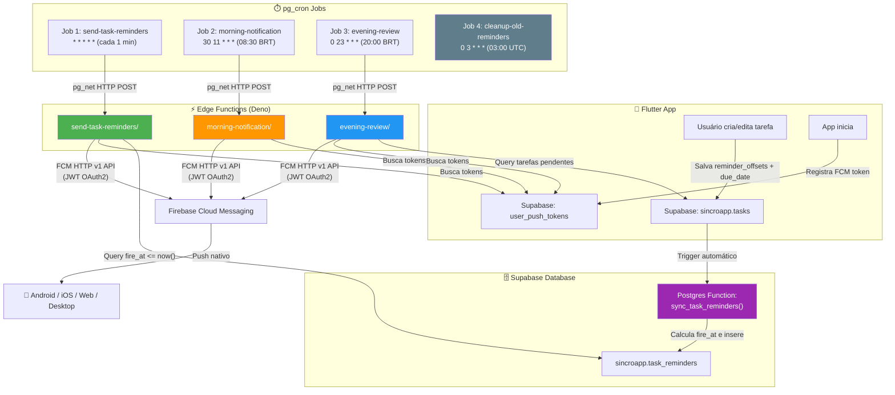
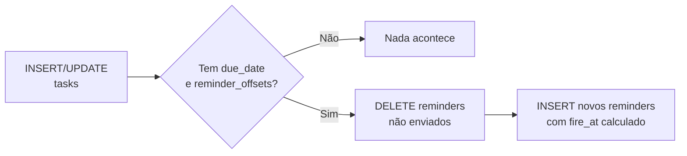
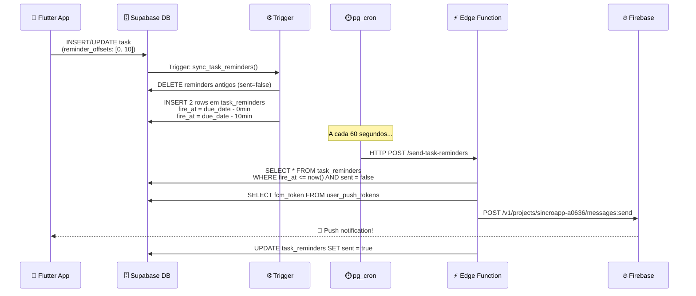
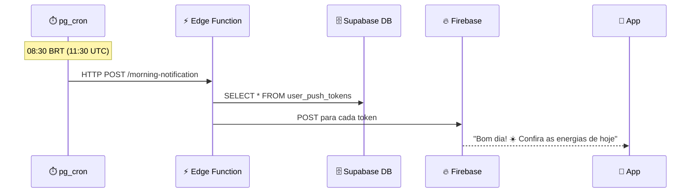
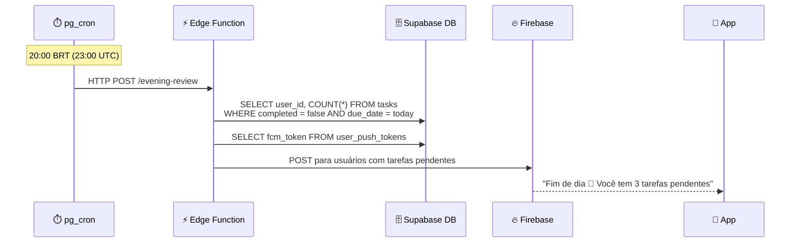
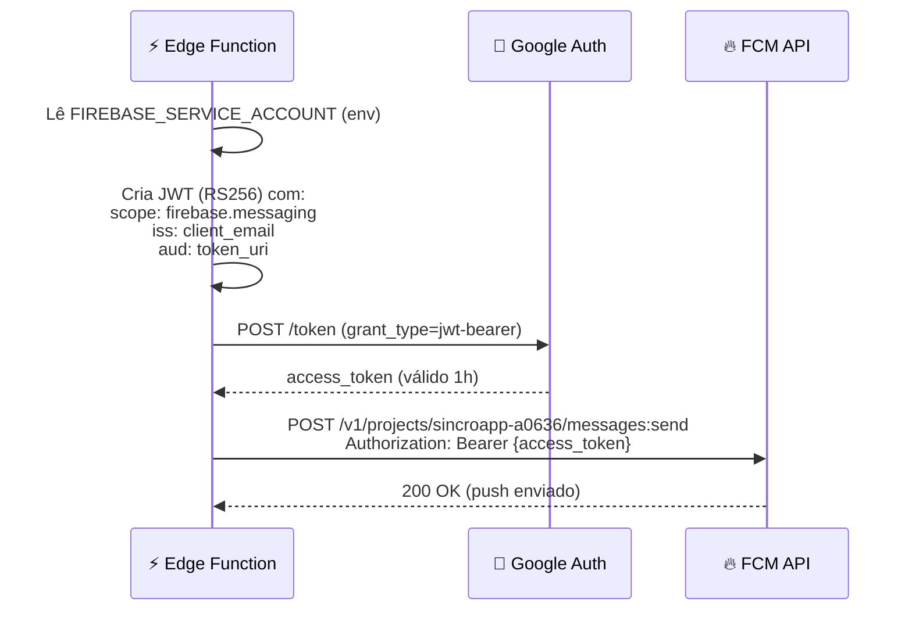

# 🔔 Sistema de Notificações Push — SincroApp

> Documentação completa do sistema de notificações push profissional e escalável.
> Última atualização: 2026-03-06 | Status: ✅ **Operacional**

---

## Visão Geral

O SincroApp utiliza um sistema **event-driven** para notificações push, rodando 100% dentro da infraestrutura do **Supabase self-hosted** (Edge Functions + pg_cron), sem dependência do servidor VPS para notificações.

### Stack de Tecnologias

| Componente | Tecnologia | Função |
|---|---|---|
| **Banco de Dados** | Supabase PostgreSQL (self-hosted) | Armazena tarefas, lembretes agendados, tokens FCM |
| **Agendamento** | `pg_cron` + `pg_net` | Executa jobs a cada minuto/hora/dia |
| **Lógica** | Supabase Edge Functions (Deno) | Processa lembretes e envia pushes |
| **Push Delivery** | Firebase Cloud Messaging (FCM) HTTP v1 | Entrega push para Android, iOS, Web, Desktop |
| **Client** | Flutter (`firebase_messaging`) | Recebe push e exibe notificações locais |

### Infraestrutura

| Recurso | Valor |
|---|---|
| **Supabase URL** | `https://supabase.studiomlk.com.br` |
| **Firebase Project ID** | `sincroapp-a0636` |
| **VPS** | Self-hosted com Docker Compose |
| **Edge Functions Path** | `/var/www/app/supabase/volumes/functions/` |

---

## Arquitetura Geral



---

## Tabelas do Banco de Dados

### `sincroapp.tasks` (Campos relevantes para notificações)

| Coluna | Tipo | Descrição |
|---|---|---|
| `id` | uuid | ID da tarefa |
| `user_id` | uuid | Dono da tarefa |
| `text` | text | Texto da tarefa |
| `due_date` | timestamptz | Data/hora do agendamento |
| `completed` | boolean | Se está concluída |
| `reminder_offsets` | jsonb | Array de minutos antes do due_date: `[0, 10, 30]` |
| `reminder_at` | timestamptz | Legado: horário fixo do lembrete |
| `journey_title` | text | Título da jornada (para contexto no push) |

> **Colunas removidas:** `reminder_hour`, `reminder_minute`, `shared_from_user_id`, `reminder_sent` (não eram mais usadas)

### `sincroapp.task_reminders` ⭐ Nova

| Coluna | Tipo | Descrição |
|---|---|---|
| `id` | uuid | ID do lembrete (PK, auto-gerado) |
| `task_id` | uuid | FK → tasks.id (CASCADE DELETE) |
| `user_id` | uuid | Dono (denormalizado para performance) |
| `offset_minutes` | integer | Offset em minutos (0 = na hora exata) |
| `fire_at` | timestamptz | **Horário exato de disparo** (pré-calculado) |
| `sent` | boolean | Se já foi enviado (default: false) |
| `sent_at` | timestamptz | Quando foi enviado |

> **Cada offset = 1 row.** Se uma tarefa tem `reminder_offsets: [0, 10, 30]`, a trigger cria 3 rows, cada uma com `fire_at = due_date - offset_minutes`.

**Indexes:**
- `idx_task_reminders_fire_at` → Busca rápida de lembretes vencidos
- `idx_task_reminders_task_id` → Join com tasks
- `idx_task_reminders_user_id` → Busca por usuário

### `sincroapp.user_push_tokens`

| Coluna | Tipo | Descrição |
|---|---|---|
| `user_id` | uuid | ID do usuário |
| `fcm_token` | text | Token FCM do dispositivo |

---

## Trigger: `sync_task_reminders()`

Trigger automático na tabela `tasks` (INSERT e UPDATE) que:

1. **Deleta** lembretes antigos não enviados da tarefa
2. **Calcula** `fire_at` para cada offset: `due_date - (offset * interval '1 minute')`
3. **Insere** novos rows em `task_reminders`
4. **Ignora** tarefas sem `due_date` ou sem `reminder_offsets`



---

## pg_cron Jobs (4 Agendamentos)

| Job | Schedule (UTC) | Horário BRT | Função |
|---|---|---|---|
| **1** | `* * * * *` | Cada 1 minuto | `send-task-reminders` — Busca lembretes vencidos e envia push |
| **2** | `30 11 * * *` | 08:30 | `morning-notification` — Push matinal motivacional |
| **3** | `0 23 * * *` | 20:00 | `evening-review` — Push noturno com tarefas pendentes |
| **4** | `0 3 * * *` | 00:00 | Limpeza de lembretes enviados há mais de 7 dias |

**Verificar jobs:**
```sql
SELECT * FROM cron.job;
SELECT * FROM cron.job_run_details ORDER BY start_time DESC LIMIT 10;
```

---

## Fluxos Detalhados

### Fluxo 1: Lembrete de Tarefa



### Fluxo 2: Notificação Matinal (08:30 BRT)



### Fluxo 3: Revisão Noturna (20:00 BRT)



---

## Autenticação Firebase (JWT OAuth2)

As Edge Functions usam a **FCM HTTP v1 API** (API moderna) com autenticação JWT:



> A chave privada RSA do service account é usada para assinar o JWT. Não é necessário nenhum SDK do Firebase — tudo é feito via HTTP puro.

---

## Arquivos do Sistema

### Edge Functions (`/var/www/app/supabase/volumes/functions/`)

| Arquivo | Descrição |
|---|---|
| `send-task-reminders/index.ts` | Processa lembretes vencidos e envia push via FCM |
| `morning-notification/index.ts` | Push matinal para todos os usuários |
| `evening-review/index.ts` | Push noturno para quem tem tarefas pendentes |

### SQL Migrations

| Arquivo | Descrição |
|---|---|
| `20260306_notification_system.sql` | Tabela `task_reminders`, trigger, indexes, RLS, backfill |
| `20260306_pgcron_schedule.sql` | Agendamento pg_cron para as 3 Edge Functions + cleanup |

### Flutter (Client)

| Arquivo | Descrição |
|---|---|
| `lib/features/tasks/models/task_model.dart` | Model com `reminderOffsets` (jsonb array) |
| `lib/services/supabase_service.dart` | Salva/lê offsets + due_date no Supabase |

### Docker (Self-Hosted)

| Arquivo | Descrição |
|---|---|
| `docker-compose.yml` | Serviço `functions` com Firebase env vars |
| `.env` | `FIREBASE_SERVICE_ACCOUNT` e `GOOGLE_PROJECT_ID` |

---

## Variáveis de Ambiente

Configuradas no `.env` do Supabase (`/var/www/app/supabase/.env`):

| Variável | Descrição | Origem |
|---|---|---|
| `GOOGLE_PROJECT_ID` | `sincroapp-a0636` | Firebase Console |
| `FIREBASE_SERVICE_ACCOUNT` | JSON completo do service account | Firebase Console → Configurações → Contas de serviço |

> As variáveis `SUPABASE_URL`, `SUPABASE_SERVICE_ROLE_KEY` e `SUPABASE_ANON_KEY` são injetadas automaticamente pelo Docker Compose.

---

## Escalabilidade

| Métrica | Capacidade |
|---|---|
| **Usuários simultâneos** | ~1.000.000+ (FCM gerencia fan-out) |
| **Lembretes/minuto** | ~100 por batch (Edge Function limit) |
| **Precisão** | ± 1 minuto (granularidade pg_cron) |
| **Custo quando ocioso** | Zero (event-driven, sem polling) |
| **Resiliência** | Docker auto-restart, pg_cron persistente |

### Comparação: Antes vs Agora

| Aspecto | ❌ Antes (Polling VPS) | ✅ Agora (Event-Driven) |
|---|---|---|
| **Mecanismo** | `setInterval(60s)` no Node.js | pg_cron + Edge Functions |
| **Dependência** | VPS deve estar online | Supabase gerenciado (Docker) |
| **Tracking** | `reminder_sent` (por task) | `task_reminders.sent` (por offset) |
| **Escalabilidade** | ~1.000 users | ~1.000.000+ users |
| **Precisão** | ± 60s + latência de rede | ± 60s (local ao banco) |
| **Custo CPU** | Constante (polling) | Zero quando ocioso |
| **Código removido** | — | ~190 linhas de `index.js` |

---

## Manutenção

### Verificar se está funcionando
```sql
-- Jobs agendados
SELECT * FROM cron.job;

-- Últimas execuções
SELECT * FROM cron.job_run_details ORDER BY start_time DESC LIMIT 10;

-- Lembretes pendentes
SELECT * FROM sincroapp.task_reminders WHERE sent = false ORDER BY fire_at;

-- Lembretes enviados recentemente
SELECT * FROM sincroapp.task_reminders WHERE sent = true ORDER BY sent_at DESC LIMIT 10;
```

### Logs da Edge Function
```bash
# Na VPS
docker logs supabase-edge-functions --tail 50 -f
```

### Testar manualmente uma Edge Function
```bash
curl -X POST https://supabase.studiomlk.com.br/functions/v1/send-task-reminders \
  -H "Authorization: Bearer SERVICE_ROLE_KEY" \
  -H "Content-Type: application/json" \
  -d '{}'
```

### Recriar jobs (se necessário)
```sql
-- Remover todos os jobs
SELECT cron.unschedule(jobid) FROM cron.job;

-- Re-execute o arquivo 20260306_pgcron_schedule.sql
```
